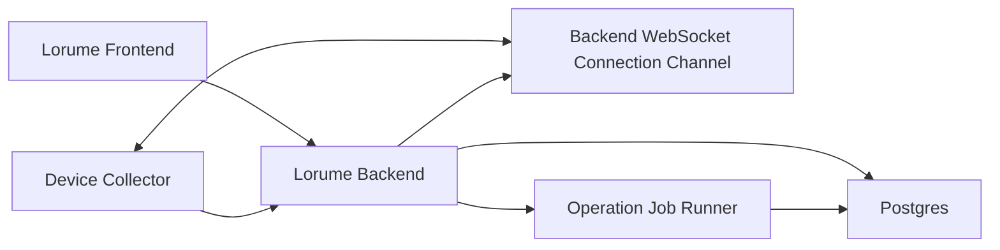

# Backend Service Spec

版本：TinySpec v0.6

Lorume backend 是独立于 Vite 的正式服务入口，用于承接登录与组织访问、collector 上报、Postgres 持久化、Runtime Fleet / Runs 查询、异步 Operation / Job Runner、通知投递和设备连接健康。当前已经具备本地长期运行、production-like Docker / Nginx 验收形态，以及 ECS 部署形态。

## 目标

- 提供独立于 Vite 的 Lorume backend 服务，前端和 collector 都通过 HTTP / WebSocket 访问它。
- 使用 Postgres 持久化 Device、Runtime、Agent、Task 和采集记录。
- 保留设备侧主动连接后端的模型：collector 通过 outbound WebSocket 上报连接健康，通过 HTTP POST 上报采集结果。
- 将 Runs / Runtime Fleet 的正式数据读取固定为“后端查询、前端展示”，不再使用前端拉 latest snapshot 后本地筛选作为正式路径。
- 每次 collector 上报都记录 ingestion 结果，并由后端生成设备采集诊断结论，支持排查某个平台为什么缺数据、什么时候缺数据、缺了哪些能力。
- 统一维护规范化错误码到用户可读 message 的映射；后端 API、collector 上报失败、通知和 UI 错误状态必须复用同一语义，不向用户展示技术错误字符串。
- 使用 Postgres-backed Operation / Job Runner 承接通知和后续已规格化的异步动作。
- 提供 production-like 本地部署配置：后端 bundle、前端静态构建、Nginx 反代和 Postgres compose。
- 保持当前功能和测试质量，不为尚未上线的旧实现背兼容包袱。

## 非目标

- 不引入云数据库、复杂 secret manager 或完整审计系统。
- 当前版本不做中控 Agent、聊天入口、任务调度、消息代理或外部平台写操作。
- 当前版本不保留 file-backed latest JSON 作为正式后端路径；fixture 只允许作为开发期离线预览和测试辅助。
- 当前版本不拆微服务，不引入外部消息队列，不做跨机调度。

## 环境依赖

本地开发、harness 和 production-like 本地部署需要：

- Node.js 22.x。
- npm 10.x。
- Docker 27.x 或兼容版本。
- Docker Compose v2。
- Postgres 15 及以上。默认通过 Docker 容器运行，不要求本机安装 `psql`。

开发机可以通过 `npm run db:up` 启动 Postgres，通过 `npm run db:setup` 应用 schema。Docker 镜像拉取失败属于环境问题，不改变代码路径或正式验收规则。

## 架构

边界：

- Frontend 只消费后端查询 API，不解释 OpenClaw、Multica、Slock 原始字段。
- Backend 负责 API、入库、查询和设备连接状态；不负责向设备下发采集或探测命令。
- Collector 负责只读采集和上报，不承担后端查询、用户权限或 UI 语义。
- Runtime adapter 仍负责把平台差异转换为 Lorume-owned semantics。

## 数据模型

当前只保留必要表：

- `devices`：设备身份、hostname、OS、架构、collector 状态、最近同步和连接摘要。
- `runtimes`：设备上的 Runtime / 平台入口；当前实现只接收 OpenClaw 和 Codex。
- `agents`：Lorume 管理视角下的 Managed Agent。
- `tasks`：Agent 承接的业务工作。Task 只通过 `agent_id` 关联 Agent，不直接保存 Runtime 或 Device 外键。
- `collector_ingestions`：每次 collector 上报的结果、数量、耗时、结构化 diagnostics 和错误摘要。
- `operations`：用户可见的异步动作状态。
- `operation_jobs`：后端 runner 可 claim 和执行的任务单元。
- `notification_events` / `notification_threads` / `notification_deliveries` / `notification_preferences`：公共通知事件、聚合、投递和偏好。

不保留旧 inventory / work_state 表或兼容读写入口。暂不单独建 `device_connections`。WebSocket 在线状态可以保存在内存控制通道；可持久化的连接摘要先落在 `devices` 和 `collector_ingestions` 中。

## 上报与采集

Collector 保持主动上报：

- 当前正式写入路径分为两类：`device_state` metadata snapshot 包含 Device、Runtime、Agent 和 diagnostics；`task_batch` 包含变化 Task。
- `POST /api/device-state-snapshots` 的 `tasks` 必须为空数组。后端按稳定 ID upsert Device、Runtime 和 Agent。
- `POST /api/device-task-batches` 按稳定 Task ID upsert Task，并返回 ACK 列表；collector 只有在 ACK 中看到当前 `{ id, hash }` 后才推进本地 task sync cache。
- Task 删除使用 soft tombstone 语义。后端不因普通 collector sync 物理删除 Task；只在认证后的 `task_batch.removedTaskIds` 被 ACK 后标记 stale，默认产品查询 API 过滤 stale rows。
- Runtime / Agent / Device metadata 仍由 metadata snapshot 路径按当前快照 upsert 和收敛。
- `inventory` 和 `work_state` 不作为兼容回退保留；对应旧 HTTP 入口、CLI 命令和 DB 表都不属于当前规则。
- Task 必须引用当前数据库中真实存在的 Agent。无法关联 Agent 的平台证据由 adapter 跳过并记录结构化 diagnostic，不能写成悬空任务。
- 每次上报必须写 `collector_ingestions`，记录设备、类型、状态、对象数量、结构化 diagnostics、规范化错误码、用户可读错误摘要、`collectedAt` 和 `receivedAt`。
- 认证后的 collector 上报失败除了写入 `collector_ingestions`，还必须进入统一 Notification 模型，按设备和 snapshot type 聚合为 runtime 采集失败通知，接收人为所属组织 active owner / admin。
- Collector 上报 `device_state` 或 `task_batch` 时遇到网络错误或后端 `5xx` 可以做有限重试；`4xx` 代表 payload 或权限问题，不应通过重试掩盖。
- 设备 WebSocket 在线只表示控制面可达，不等于 `device_state` 采集成功。采集诊断只从 `collector_ingestions` 中最近一次 `device_state` 记录判断；没有记录就显示尚未收到当前采集结果，不回退旧采集类型。
- 最近同步时间表达数据新鲜度，并作为 Device 四态诊断输入之一。用户可见 Device 状态只保留 `同步中`、`在线`、`离线`、`异常`；内部 stale / freshness reason code 只服务诊断，不作为额外 UI 状态。采集成功但存在 adapter `warning` diagnostic 时仍算成功，diagnostic 进入 ingestion、日志、通知或后续诊断入口。
- 采集失败、adapter 异常、JSON 结构不可用、token 无效或数据库写入失败时，必须写结构化日志。日志字段至少包含 `service`、`event`、`level`、`time`、`errorCode` 和可读 `message`，并且不得包含 device token、session token、邀请 token、邮箱验证码或平台 API key。
- 当前 Device / Runtime / Agent metadata 每轮按 snapshot upsert；Task 使用本地 `{ id, hash }` cache 做变化上报、soft tombstone 和批量 ACK。Task cache 必须绑定 `schemaVersion`、规范化 `serverUrl`、`deviceId` 和 device token 前 12 位 `tokenPrefix`；注册作用域缺失或不一致时，collector 视为空 cache 并重新分批上报当前可见 Task。

建议节奏：

- `10-30s`：heartbeat / 连接状态。
- `30-60s`：`device_state` 变化采集。
- `5-10min`：Device / Runtime / Agent metadata full reconcile。
- 注册作用域变化：重新注册设备、切换 backend、切换 device id 或更换 device token 后，collector 自动重传当前可见 Task。

## API

保留现有 collector 上报入口和连接健康入口：

- `GET /healthz`
- `GET /readyz`
- `GET /api/device-collector/install.sh`
- `GET /api/device-collector/files/:fileName`
- `POST /api/device-state-snapshots`
- `POST /api/device-task-batches`
- `WS /api/device-control/ws`

Installer 入口只服务无密钥设备包文件，device token 由已鉴权的组织设置页面生成并拼入用户可见的一行命令。后端触发式采集命令不属于当前 backend service。Runtime 数据只通过设备认证后的 metadata snapshot 和 Task batch 进入后端。

正式查询 API：

- `GET /api/runtime-fleet`
  - 当前不接收搜索或筛选参数。
  - 返回 Runtime Fleet 页面需要的全量设备、Runtime、Agent、summary 和详情基础数据。
- `GET /api/runtime-tasks`
  - 参数：`search`、`status`、`channelKind`、`startAt`、`endAt`、`limit`、`cursor`。
  - 后端负责筛选、时间范围、稳定 cursor 分页和排序，返回 `total` 与 `nextCursor`。
  - 返回行是 Lorume `Task`。`Task.status` 是任务当前状态的唯一来源，Task 不包含 `runtimeId` 或 `lastRun`。
- `GET /api/devices/:deviceId/ingestions`
  - 返回最近采集记录，用于解释数据新鲜度和缺口；记录必须包含 `collectedAt` 和 `receivedAt`，方便区分设备采集完成时间与后端接收时间。
- `GET /api/devices/:deviceId/collection-health`
  - 返回设备级采集诊断摘要，只返回 `device_state` 检查项。
  - `healthy`：最近一次上报成功；`debug` / `info` / `warning` diagnostics 只进入诊断信息，不改变 Runtime Fleet 展示状态。
  - `failed`：尚未收到记录、最近一次上报失败、payload 结构不可用或后端写入失败。
  - 该接口不再返回用户界面专用的 `warning`、`stale` 或 `unknown` 状态；Runtime Fleet 展示层只把 `failed` 折叠为对象 `异常`。
  - 该接口面向产品诊断，不返回外部平台密钥、原始 payload 或调试-only 字段。
- `GET /api/operations`
  - 参数：`organizationId`、`status`、`resourceType`、`resourceId`、`targetType`、`targetId`、`limit`。
  - 需要当前用户属于该组织。
  - 返回用户可见的异步动作状态，供设备刷新、通知投递和后续长耗时动作展示进度。
- `GET /api/operations/:operationId`
  - 需要当前用户属于该 Operation 所属组织。
  - 返回 Operation 和最近 Job 状态。
- `GET /api/notifications`
  - 参数：`organizationId`。
  - 需要当前用户属于该组织。
  - 返回当前用户可见的通知 Thread。
- `GET /api/notifications/:threadId`
  - 需要当前用户属于该 Thread 所属组织，且该 Thread 有当前用户的站内投递。
  - 返回 Thread 和 Delivery 详情。

前端缓存策略：

- 搜索输入 debounce。
- 筛选条件变化后请求后端。
- 前端保留当前结果、loading、empty、error 状态。
- 当前不做复杂离线缓存；生产构建下后端不可用时展示明确错误，不回退 fixture。

## 部署形态

本地开发形态：

- Postgres 使用 `docker-compose.yml` 中的 `postgres` 服务。
- Backend 使用 `npm run dev:backend` 常驻运行。
- Frontend 使用 `npm run dev`，通过 Vite proxy 访问 backend。

Production-like 本地验收形态：

- `npm run build:backend` 使用 `vite.backend.config.ts` 生成 `dist/backend/backend-server.mjs`。
- `Dockerfile.backend` 构建 backend image，并在启动前执行 schema setup。
- `Dockerfile.frontend` 构建 Vite 静态前端，并通过 Nginx 提供静态资源。
- `nginx.lorume.conf` 反代 `/api`、`/healthz`、`/readyz` 和 WebSocket upgrade 到 backend。
- `docker-compose.prod-like.yml` 编排 Postgres、backend、frontend，用于 ECS 前的本地生产形态 smoke。

生产部署形态：

- 生产域名、ICP备案、DNS、TLS 证书和公网可达性属于部署/运维验证，不作为项目 harness 的必需条件。
- 系统 Nginx 负责公网 `80/443`、HTTP 到 HTTPS 跳转、TLS 证书、静态前端反代、`/api`、`/healthz`、`/readyz` 和 WebSocket upgrade。
- Docker Compose 运行 Postgres、backend 和 frontend 容器；frontend 绑定 `127.0.0.1:8080`，backend 绑定 `127.0.0.1:4173`，Postgres 不暴露宿主端口。
- Nginx 必须配置足够的 `client_max_body_size`，当前为 `50m`，否则 collector 的 `device_state` 快照可能被 413 拒绝。

后续以当前生产部署形态为基线补齐生产鉴权、备份、监控和告警。

## Harness

后端正式化必须补齐以下检查：

- schema harness：当前 `db/schema.sql` 能在空 Postgres 上创建最新 schema，重复执行保持同一 schema 结果。
- repository harness：`device_state` snapshot 能 upsert 并查询 Device / Runtime / Agent / Task。
- HTTP API harness：collector POST、runtime fleet query、runtime task query、ingestion query。
- readiness harness：`/healthz` 和 `/readyz` 能区分进程存活与数据库可用。
- connection channel harness：WebSocket hello、heartbeat、断连和 stale 判定继续可用。
- operation runner harness：Postgres Job claim、lease、retry、完成态和失败态。
- notification harness：事件聚合、限流、in-app 记录和 email delivery 记录。
- collector notification harness：认证后的 collector payload 失败会写 ingestion 记录并生成限流后的 runtime 采集失败通知。
- collector contract harness：当前 collector `device_state` payload 可被后端接收。
- error catalog harness：规范化错误码能映射为用户可读 message，API 不能直接返回 `invalid_or_expired_code` 一类技术字符串。
- structured logging harness：后端和 collector 失败路径能写结构化日志，并确认 secret 字段被脱敏。
- deploy config harness：backend bundle、Dockerfile、Nginx、production-like compose 必须和当前服务入口一致。
- production smoke harness：`npm run smoke:production` 默认只检查公开部署入口，例如 `/healthz`、`/readyz` 和 collector installer 公开资源；只有显式提供 `LORUME_SMOKE_COOKIE` 或 `LORUME_SMOKE_BEARER_TOKEN` 时，才检查已鉴权 Runtime Fleet、Runs、collection-health 和 diagnostics 读路径。它不得创建 device token、运行 installer、POST collector snapshot 或写入生产数据。
- backend API-only E2E harness：本地 isolated Postgres 加本地 backend 验证 device token 创建、installer assets、真实 collector 进程上传、Device diagnostics、query APIs 和 heartbeat-only WebSocket。
- Playwright harness：Runtime Fleet 和 Runs 页面继续通过，且不依赖手动 dev 数据。
- `./scripts/verify.sh` 必须包含新增 backend 检查。
