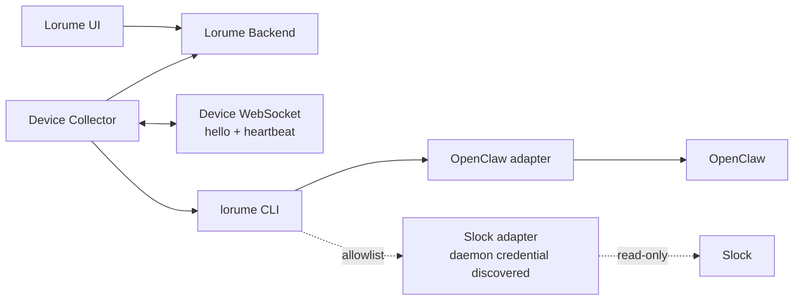

# Runtime & Device Registration Spec

版本：TinySpec v0.8

Lorume 通过设备侧 collector 主动识别本机运行资产，并向后端上报标准化设备元数据和 Task 批次。当前默认 runtime adapter allowlist 启用 OpenClaw 和 Slock；Slock adapter 只在本机 `.slock/agents` 与 Slock daemon 进程参数能提供 ownership proof、server URL 和 token 时执行，否则安静跳过。其他 Runtime adapter 在没有对应 spec 和 harness 前不采集、不执行命令、不读目录。

## 目标

- 通过一条本地安装命令在设备上安装 Lorume Device Collector。
- Collector 作为设备侧常驻 Device Agent 运行，设备主动连接 Lorume。
- Collector 只读采集本机事实和已启用 adapter 覆盖的运行资产。
- 后端接收设备主动上报的 Device / Runtime / Agent metadata snapshot 和 Task batch，并提供 Runtime Fleet / Runs 查询 API。
- Lorume 产品模型只保留四个一等对象：`Device`、`Runtime`、`Agent`、`Task`。
- WebSocket 控制面只支持设备主动 `hello`、`heartbeat` 和连接健康判定；不下发采集、探测、调度或任意命令。

## 非目标

- 不处理中控 Agent、跨平台消息路由或外部平台 Agent 创建/编辑。
- 不开放远程任意命令执行。
- 不把 WebSocket 用作聊天通道、任务调度通道或外部平台协议兼容层。
- 不把 Conversation、Execution、Capability、SourceRef 或 Channel 做成一等实体。
- 不采集 Multica 或独立 Codex adapter。Slock adapter 规则见 `docs/product/runtime-slock-adapter-spec.md`，默认启用后仍只能按其只读 ownership proof 和 Task 映射规则采集；其中 `codex` 只能作为 Slock profile 的 runtime kind 进入模型，不代表已经实现 Codex adapter。未来 Runtime kind 只有在实现、spec 和 harness 同步落地时才进入模型；Claude Code 从当前支持列表移除。
- 不把 adapter 命令、能力、原始引用、私有路径或 raw payload 暴露给 UI 主模型。

## 架构



## 四大对象

### Device

Device 表示一台已注册设备。它只记录机器事实、collector 元信息和采集状态。

```ts
export interface Device {
  id: string;
  hostname: string;
  os: string;
  architecture?: string;
  collectionStatus: CollectionStatus;
  lastSeenAt?: string;
  user?: { username?: string };
  network?: {
    publicIp?: string;
    localIps?: string[];
  };
  collector?: {
    version: string;
    installPath?: string;
    lastError?: string;
  };
}
```

Device 不保存由 Runtime、Agent 或 Task 推导出来的状态，不包含额外 display name、connection mode 或工作忙闲。

### Runtime

Runtime 表示设备上的可识别运行环境。当前 RuntimeKind 支持 `openclaw` 和 `codex`：`openclaw` 可由 OpenClaw adapter 采集，`codex` 目前只作为 Slock profile runtime 的可归属类型进入模型，不代表 Lorume 已经实现 Codex adapter、Codex CLI 采集或 Codex Task 采集。Slock、Multica 等未来类型不能提前写入产品枚举、fixture 或测试，必须在对应 adapter、spec 和 harness 落地时同改。

```ts
export type RuntimeKind = "openclaw" | "codex";

export interface Runtime {
  id: string;
  deviceId: string;
  kind: RuntimeKind;
  name: string;
  version?: string;
  collectionStatus: CollectionStatus;
  lastSeenAt?: string;
  diagnostics?: {
    paths?: Array<{ label: string; path: string }>;
    lastError?: string;
  };
}
```

Runtime 不包含 `endpoint`、`capabilities` 或 `sourceRefs`。这些信息如有排障价值，只能进入 diagnostics、结构化日志或 DB raw。

### Agent

Agent 表示某个 Runtime 下的工作主体。Agent 只通过 `runtimeId` 归属 Runtime；平台来源由关联 Runtime 查询得到。

```ts
export interface Agent {
  id: string;
  runtimeId: string;
  name: string;
  collectionStatus: CollectionStatus;
  lastSeenAt?: string;
  diagnostics?: {
    paths?: Array<{ label: string; path: string }>;
    lastError?: string;
  };
}
```

Agent 不包含 `origin`、`sourceRefs` 或 `load`。任务数量、进行中数量等运行负载从 `Task.agentId` 聚合得到。

### Task

Task 表示 Agent 承接的一项工作。Task 只关联 Agent，不直接关联 Runtime；需要 Runtime 或 Device 时通过 `Task.agentId -> Agent.runtimeId -> Runtime.deviceId` 查询。

```ts
export type TaskStatus =
  | "todo"
  | "in_progress"
  | "review"
  | "done"
  | "blocked"
  | "failed"
  | "cancelled"
  | "unknown";

export interface Task {
  id: string;
  agentId: string;
  taskType: "conversation" | "scheduled";
  userMessage?: string;
  agentReply?: string;
  status: TaskStatus;
  adapter: { kind: "openclaw" | "slock" };
  channel?: {
    kind: "dingtalk" | "webchat" | "slock";
    externalId?: string;
  };
  conversation?: {
    title?: string;
    externalId?: string;
    lastActivityAt?: string;
  };
  assignee?: { name: string; externalId?: string };
  creator?: { name?: string; externalId?: string };
  raw?: {
    openclaw?: {
      status?: string;
      statusSource?: "session" | "trajectory" | "tasks_list";
      sessionId?: string;
      sessionKey?: string;
      messageId?: string;
      trajectoryRunId?: string;
    };
    slock?: {
      status?: string;
      taskNumber?: string;
      messageId?: string;
      channelTarget?: string;
      threadTarget?: string;
      taskClaimedAt?: string;
      taskCompletedAt?: string;
    };
  };
  error?: string;
  createdAt?: string;
  updatedAt?: string;
}
```

Task 不包含 `runtimeId`、`run`、`lastRun` 或独立 execution 状态。`Task.status` 是任务当前状态的唯一来源。
Runtime 名称不能写入 `Task.channel`；如果任务没有当前已实现的用户触点证据，就省略 `channel` 和 `conversation`，而不是把 OpenClaw、Slock、Multica 或 Codex 当成渠道。
Task 不保存 `title`、`description`、`toolCalls` 或 `lastSeenAt`。页面需要标题时，从 `userMessage` 生成短展示标题；需要任务新鲜度时，只看源系统业务时间 `updatedAt` / `createdAt`。
Task 的 `adapter.kind` 表示哪一个 collector adapter 归一化了这条 Task。当前实现支持 `openclaw` 和 `slock`；Telegram、Slack 等未实现类型不得提前写入枚举或 fixture。

## 状态规则

### CollectionStatus

```ts
export type CollectionStatus = "syncing" | "online" | "offline" | "error";
```

| 状态 | 含义 |
|---|---|
| `syncing` | 已注册或已连接，但还没有形成可用采集结果。 |
| `online` | 最近一次成功采集中出现，且数据仍处于新鲜窗口内。 |
| `offline` | 曾经成功采集过，但连接或采集结果已过期。 |
| `error` | 最近一次采集、结构校验或入库失败。 |

Runtime 和 Agent 的 `collectionStatus` 只表达采集可用性，不表达工作忙闲。工作中、空闲、任务数量等信息由 Task 聚合得到。

### TaskStatus

| OpenClaw / 外部证据 | Lorume `TaskStatus` |
|---|---|
| queued, pending, todo | `todo` |
| running, active, in_progress | `in_progress` |
| review, in_review | `review` |
| succeeded, completed, done | `done` |
| blocked, waiting_on_dependency | `blocked` |
| failed, error | `failed` |
| cancelled, canceled | `cancelled` |
| 不能可靠判断 | `unknown` |

## 上报 Envelope

CLI 在设备本地生成一份统一 `DeviceStateSnapshot`。它是 collector 内部传输 envelope，不是产品实体。Collector 对后端上报时必须拆成两类请求：metadata snapshot 和 Task batch。

```ts
export interface DeviceStateSnapshot {
  collectedAt: string;
  device: Device;
  runtimes: Runtime[];
  agents: Agent[];
  tasks: Task[];
  diagnostics?: {
    items: CollectionDiagnosticItem[];
  };
}

export type CollectionDiagnosticSeverity = "debug" | "info" | "warning" | "error";

export interface CollectionDiagnosticItem {
  code: string;
  severity: CollectionDiagnosticSeverity;
  count: number;
  message: string;
  source?: string;
  target?: "adapter" | "collector" | "snapshot" | "task";
  action?: "ignored" | "task_dropped" | "task_ingested_with_gap" | "ingestion_failed";
  sampleRefs?: string[];
}
```

HTTP 上报规则：

- `POST /api/device-state-snapshots` 只接收 Device、Runtime、Agent 和 diagnostics；`tasks` 必须为空数组。
- `POST /api/device-task-batches` 接收 Task 批次，每条 Task 带 collector 计算出的稳定 hash，也可以包含 `removedTaskIds`。
- Metadata snapshot 只按稳定 ID upsert Device、Runtime 和 Agent。由于 collector 允许按 adapter allowlist 做局部采集，后端不得把某个 metadata snapshot 里缺席的 Runtime 或 Agent 解释为删除；Runtime / Agent 下线或 tombstone 规则必须有独立 spec 和 harness 后再引入。
- `removedTaskIds` 表示这些 Task 曾经在当前 collector cache scope 中被后端 ACK，但本轮已启用且本轮实际覆盖的 adapter snapshot 已不再出现。局部 adapter 采集不得移除其他 adapter 曾经 ACK 的 Task。
- 后端按稳定 ID upsert 当前对象；收到 `removedTaskIds` 后只做 soft tombstone，例如设置 `stale_at`，不物理删除 Task，也不改变 `Task.status`。
- Runtime Fleet 和 Runs 默认查询只返回未 tombstone 的当前可见 Task。如果同一个 Task 后续重新出现，upsert 必须清除 tombstone，让它重新可见。
- Collector 本地 ACK cache 必须绑定当前注册作用域：`schemaVersion`、规范化 `serverUrl`、`deviceId` 和 `deviceToken` 的前 12 位 `tokenPrefix`。作用域缺失或不一致时，collector 必须把本地 cache 视为空并重新按批次上报当前可见 Task。
- Collector 本地只缓存已被后端 ACK 的 `{ id, hash, adapterKind, lastAckedAt }`。下一轮采集重新计算当前 Task hash，只上传 hash 变化、本地未 ACK、注册作用域不匹配、或本轮已从同 adapter snapshot 消失的 Task id。
- Collector 必须等后端返回 removal ACK 后，才从本地 ACK cache 删除对应 Task id。
- `collectedAt` 表示设备端本轮采集完成时间；`receivedAt` 表示后端收到请求时间。
- `diagnostics.items` 只存结构化聚合，不存逐条原始字符串。`debug` / `info` 是内部过滤摘要，`warning` 是数据质量缺口，`error` 是采集链路失败。
- `warning` 不改变 Device / Runtime / Agent 的 `collectionStatus`；只有采集链路 `error` 才能把对应采集状态置为 `error`。Task 自身失败只进入 `Task.status="failed"` 和 `Task.error`。

默认批次预算：

| 约束 | 默认值 | 说明 |
|---|---:|---|
| 单批最大 Task 数 | `1000` | 超过时拆分批次。 |
| 单批最大 JSON 字节 | `512KiB` | 控制网络与后端入库压力。 |

重新注册设备、切换 backend、切换 device id 或更换 device token 会改变注册作用域，并触发当前可见 Task 的批量重传。已 ACK 但本轮不可见的 Task 通过 `removedTaskIds` 标记 stale。该机制仍然使用 Task batch，不恢复“带 Task 的全量 snapshot”。

## API

- `GET /api/device-collector/install.sh`：返回无密钥远程安装入口脚本。
- `GET /api/device-collector/files/:fileName`：只允许下载白名单设备包文件。
- `POST /api/device-state-snapshots`：Collector 上报 Device / Runtime / Agent metadata snapshot，使用 device token 鉴权；`tasks` 必须为空。
- `POST /api/device-task-batches`：Collector 上报变化 Task 批次，使用 device token 鉴权；后端返回 ACK 列表供本地 cache 推进。
- `GET /api/runtime-fleet`：读取 Device、Runtime、Agent 和派生 Task 计数。
- `GET /api/runtime-tasks`：正式 Task 查询页，支持 `search`、`status`、`channelKind`、`startAt`、`endAt`、`limit`、`cursor`。
- `GET /api/devices/:deviceId/collection-health`：读取采集诊断摘要，只检查 `device_state`。
- `WS /api/device-control/ws`：只处理 `hello`、`heartbeat`、断开和 stale 判定。

## OpenClaw Adapter

OpenClaw 是当前唯一默认启用的 runtime adapter。详细字段映射见 `docs/product/runtime-openclaw-adapter-spec.md`。

| Lorume 对象 | OpenClaw 来源 | 规则 |
|---|---|---|
| Device | collector host facts | 使用现有本机事实采集逻辑。 |
| Runtime | OpenClaw config、`openclaw health --json`、`openclaw status --json` | 生成一个 `OpenClaw Gateway` runtime，kind 为 `openclaw`。 |
| Agent | OpenClaw health/status agent 列表和 config agent 列表 | 每个真实 OpenClaw agent id 生成一个 Agent。 |
| Task | OpenClaw session / trajectory / DingTalk state 证据 | 只生成能明确关联到 Agent 的 Task；无法唯一关联时跳过并记录 `warning` diagnostic。 |

Task 上报范围：

- Adapter 必须输出所有符合产品标准的 OpenClaw Task，不按数量或字节窗口丢弃已识别任务。
- 排序使用 `updatedAt -> createdAt` 的最近时间优先。
- 当前不上传 `toolCalls`。
- 体积控制由 collector 按 `512KiB / 1000 tasks` 拆分 `/api/device-task-batches`，并通过本地 ACK cache 与 Task hash 控制重传。

稳定 ID：

| 对象 | 规则 |
|---|---|
| Device | 配置中的 device id，否则 sanitized hostname。 |
| Runtime | `${deviceId}:runtime:openclaw` |
| Agent | `${runtimeId}:agent:${openClawAgentId}` |
| Task | `${agentId}:task:${openClawTaskExternalId}` |

## Adapter Allowlist

Collector / CLI 必须支持 runtime adapter allowlist：

```sh
LORUME_ENABLED_RUNTIME_ADAPTERS=openclaw,slock
```

当前默认 allowlist 为 `openclaw,slock`。Slock 默认启用不等于必须存在 Slock；没有本机 Slock workspace 或无法从 Slock daemon 进程参数发现 server URL/token 时，Slock adapter 不生成对象。被禁用的 adapter 不得执行命令、读取目录或生成对象。

## 安装与卸载

组织 owner / admin 可以生成 device token，并得到一条包含 server URL、device id 和 device token 的安装命令。Device token 明文只在创建响应中出现一次，后端只保存 hash 和 token prefix。

远程安装入口不包含密钥。它只从同一个 Lorume backend 下载白名单设备包文件到临时目录，再调用 `scripts/install-device-collector.sh --source-dir <temp-dir>` 完成本机安装、配置写入和 launchd / systemd 服务注册。

安装目录必须包含后续生命周期命令需要的完整设备包文件：`install-device-collector.sh`、`lorume-device-collector.mjs`、`lorume-runtime-adapters.mjs`、`lorume.mjs` 和 `config.json`。已安装的 `lorume.mjs collector stop/uninstall` 必须能通过同目录的 `install-device-collector.sh` 完成停止或卸载，不能依赖仓库源码目录仍然存在。`uninstall` 必须移除 collector 安装目录、服务定义、collector 日志目录和 task sync cache；如果 `$HOME/.lorume` 已为空，也应一并移除。

真实设备验收时，agent 可以运行 Lorume stop、uninstall、install 命令，也可以读取日志、服务状态和文件状态。agent 不能手动删除残留的 Lorume 文件、launchd plist、systemd unit 或进程状态来掩盖卸载缺陷；如果 uninstall 后仍有残留，必须停止真实设备流程，在项目中修复卸载能力并重新验证。

## 验收

- `lorume collect device-state --json` 在 OpenClaw fixture 和 fake CLI 环境下输出带 `collectedAt` 的 `DeviceStateSnapshot`。
- 默认采集 allowlist 执行 OpenClaw adapter，并在本机 Slock daemon 凭据和 workspace ownership proof 可用时执行 Slock adapter；不执行 Multica 或独立 Codex adapter。
- Collector 将本地 snapshot 拆成 metadata snapshot 和 Task batches；后端能分别接收 `POST /api/device-state-snapshots` 与 `POST /api/device-task-batches`，并写入 Device、Runtime、Agent、Task。
- Runtime Fleet 只展示 Device/Runtime/Agent 的 collection status 和派生 Task 计数。
- Runs / Work Board 消费 Task 数组，并按 `Task.status` 分组。
- Installer harness 必须验证安装目录文件完整性，并验证已安装 CLI 能执行 `collector uninstall`。
- 自动化测试只使用本地 isolated backend/Postgres，不写真实生产后端。
- 真实设备验收采用观察者方式：发现产品能力残留或采集缺口时修代码和测试，不手动清理掩盖问题。
