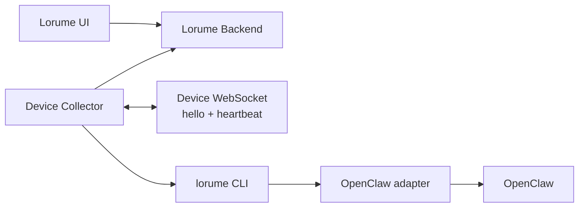

# Runtime & Device Registration Spec

版本：TinySpec v0.6

Lorume 通过设备侧 collector 主动识别本机运行资产，并向后端上报标准化 device state snapshot。当前阶段采用 OpenClaw-first：只把 OpenClaw 迁移到新的统一模型，其他 Runtime adapter 默认不采集、不执行命令、不读目录。

## 目标

- 通过一条本地安装命令在设备上安装 Lorume Device Collector。
- Collector 作为设备侧常驻 Device Agent 运行，设备主动连接 Lorume。
- Collector 只读采集本机事实和 OpenClaw 运行资产。
- 后端接收设备主动上报的 device state snapshot，并提供 Runtime Fleet / Runs 查询 API。
- Lorume 产品模型只保留四个一等对象：`Device`、`Runtime`、`Agent`、`Task`。
- WebSocket 控制面只支持设备主动 `hello`、`heartbeat` 和连接健康判定；不下发采集、探测、调度或任意命令。

## 非目标

- 不处理中控 Agent、跨平台消息路由或外部平台 Agent 创建/编辑。
- 不开放远程任意命令执行。
- 不把 WebSocket 用作聊天通道、任务调度通道或外部平台协议兼容层。
- 不把 Conversation、Execution、Capability、SourceRef 或 Channel 做成一等实体。
- 不在本阶段采集 Slock、Multica、Codex 或 Claude Code。Codex 仍可作为未来 Runtime kind 保留；Claude Code 从当前支持列表移除。
- 不把 adapter 命令、能力、原始引用、私有路径或 raw payload 暴露给 UI 主模型。

## 架构



## 四大对象

### Device

Device 表示一台已注册设备。它只记录机器事实、collector 元信息和采集状态。

```ts
export interface Device {
  id: string;
  hostname: string;
  os: string;
  architecture?: string;
  collectionStatus: CollectionStatus;
  lastSeenAt?: string;
  user?: { username?: string };
  network?: {
    publicIp?: string;
    localIps?: string[];
  };
  collector?: {
    version: string;
    installPath?: string;
    lastError?: string;
  };
}
```

Device 不保存由 Runtime、Agent 或 Task 推导出来的状态，不包含额外 display name、connection mode 或工作忙闲。

### Runtime

Runtime 表示设备上的可识别运行环境。当前支持类型为 `openclaw`、`slock`、`multica`、`codex`，但 OpenClaw-first 阶段默认只采集 `openclaw`。

```ts
export type RuntimeKind = "openclaw" | "slock" | "multica" | "codex";

export interface Runtime {
  id: string;
  deviceId: string;
  kind: RuntimeKind;
  name: string;
  version?: string;
  collectionStatus: CollectionStatus;
  lastSeenAt?: string;
  diagnostics?: {
    paths?: Array<{ label: string; path: string }>;
    lastError?: string;
  };
}
```

Runtime 不包含 `endpoint`、`capabilities` 或 `sourceRefs`。这些信息如有排障价值，只能进入 diagnostics、结构化日志或 DB raw。

### Agent

Agent 表示某个 Runtime 下的工作主体。Agent 只通过 `runtimeId` 归属 Runtime；平台来源由关联 Runtime 查询得到。

```ts
export interface Agent {
  id: string;
  runtimeId: string;
  name: string;
  collectionStatus: CollectionStatus;
  lastSeenAt?: string;
  diagnostics?: {
    paths?: Array<{ label: string; path: string }>;
    lastError?: string;
  };
}
```

Agent 不包含 `origin`、`sourceRefs` 或 `load`。任务数量、进行中数量等运行负载从 `Task.agentId` 聚合得到。

### Task

Task 表示 Agent 承接的一项工作。Task 只关联 Agent，不直接关联 Runtime；需要 Runtime 或 Device 时通过 `Task.agentId -> Agent.runtimeId -> Runtime.deviceId` 查询。

```ts
export type TaskStatus =
  | "todo"
  | "in_progress"
  | "review"
  | "done"
  | "blocked"
  | "failed"
  | "cancelled"
  | "unknown";

export interface Task {
  id: string;
  agentId: string;
  title: string;
  description?: string;
  status: TaskStatus;
  source?: { externalId?: string };
  channel?: {
    kind: "dingtalk" | "telegram" | "slack" | "slock" | "multica" | "openclaw" | "other";
    name?: string;
    externalId?: string;
  };
  conversation?: {
    title?: string;
    externalId?: string;
    lastActivityAt?: string;
  };
  assignee?: { name?: string };
  creator?: { name?: string };
  error?: string;
  createdAt?: string;
  updatedAt?: string;
  lastSeenAt?: string;
}
```

Task 不包含 `runtimeId`、`run`、`lastRun` 或独立 execution 状态。`Task.status` 是任务当前状态的唯一来源。

## 状态规则

### CollectionStatus

```ts
export type CollectionStatus = "syncing" | "online" | "offline" | "error";
```

| 状态 | 含义 |
|---|---|
| `syncing` | 已注册或已连接，但还没有形成可用采集结果。 |
| `online` | 最近一次成功采集中出现，且数据仍处于新鲜窗口内。 |
| `offline` | 曾经成功采集过，但连接或采集结果已过期。 |
| `error` | 最近一次采集、结构校验或入库失败。 |

Runtime 和 Agent 的 `collectionStatus` 只表达采集可用性，不表达工作忙闲。工作中、空闲、任务数量等信息由 Task 聚合得到。

### TaskStatus

| OpenClaw / 外部证据 | Lorume `TaskStatus` |
|---|---|
| queued, pending, todo | `todo` |
| running, active, in_progress | `in_progress` |
| review, in_review | `review` |
| succeeded, completed, done | `done` |
| blocked, waiting_on_dependency | `blocked` |
| failed, error | `failed` |
| cancelled, canceled | `cancelled` |
| 不能可靠判断 | `unknown` |

## Device State Snapshot

Collector 最终上报一份统一 snapshot。它是传输 envelope，不是产品实体。

```ts
export interface DeviceStateSnapshot {
  observedAt: string;
  device: Device;
  runtimes: Runtime[];
  agents: Agent[];
  tasks: Task[];
  diagnostics?: {
    warnings?: string[];
  };
}
```

上报是全量 snapshot。后端以当前 snapshot 为准 upsert 对象，并清理同一设备下本次没有出现的 Runtime、Agent 和 Task。

## API

- `GET /api/device-collector/install.sh`：返回无密钥远程安装入口脚本。
- `GET /api/device-collector/files/:fileName`：只允许下载白名单设备包文件。
- `POST /api/device-state-snapshots`：Collector 上报 `DeviceStateSnapshot`，使用 device token 鉴权。
- `POST /api/device-snapshots`：兼容旧 inventory 写入口；迁移期可转换为 `DeviceStateSnapshot` 或仅保留旧读写测试。
- `POST /api/runtime-work-state-snapshots`：兼容旧 work-state 写入口；迁移期不得作为新产品模型来源。
- `GET /api/runtime-fleet`：读取 Device、Runtime、Agent 和派生 Task 计数。
- `GET /api/runtime-work-items`：兼容路由名，返回 Task 查询页。
- `GET /api/devices/:deviceId/collection-health`：读取采集诊断摘要。
- `WS /api/device-control/ws`：只处理 `hello`、`heartbeat`、断开和 stale 判定。

## OpenClaw Adapter

OpenClaw 是本阶段唯一默认启用的 runtime adapter。

| Lorume 对象 | OpenClaw 来源 | 规则 |
|---|---|---|
| Device | collector host facts | 使用现有本机事实采集逻辑。 |
| Runtime | OpenClaw config、`openclaw health --json`、`openclaw status --json` | 生成一个 `OpenClaw Gateway` runtime，kind 为 `openclaw`。 |
| Agent | OpenClaw health/status agent 列表和 config agent 列表 | 每个真实 OpenClaw agent id 生成一个 Agent。 |
| Task | OpenClaw task/message/run 证据 | 只生成能明确关联到 Agent 的 Task；无法唯一关联时跳过并记录 diagnostic warning。 |

稳定 ID：

| 对象 | 规则 |
|---|---|
| Device | 配置中的 device id，否则 sanitized hostname。 |
| Runtime | `${deviceId}:runtime:openclaw` |
| Agent | `${runtimeId}:agent:${openClawAgentId}` |
| Task | `${agentId}:task:${openClawTaskExternalId}` |

## Adapter Allowlist

Collector / CLI 必须支持 runtime adapter allowlist：

```sh
LORUME_ENABLED_RUNTIME_ADAPTERS=openclaw
```

OpenClaw-first 阶段默认 allowlist 为 `openclaw`。被禁用的 adapter 不得执行命令、读取目录或生成对象。

## 安装与卸载

组织 owner / admin 可以生成 device token，并得到一条包含 server URL、device id 和 device token 的安装命令。Device token 明文只在创建响应中出现一次，后端只保存 hash 和 token prefix。

远程安装入口不包含密钥。它只从同一个 Lorume backend 下载白名单设备包文件到临时目录，再调用 `scripts/install-device-collector.sh --source-dir <temp-dir>` 完成本机安装、配置写入和 launchd / systemd 服务注册。

真实设备验收时，agent 可以运行 Lorume stop、uninstall、install 命令，也可以读取日志、服务状态和文件状态。agent 不能手动删除残留的 Lorume 文件、launchd plist、systemd unit 或进程状态来掩盖卸载缺陷；如果 uninstall 后仍有残留，必须停止真实设备流程，在项目中修复卸载能力并重新验证。

## 验收

- `lorume collect device-state --json` 在 OpenClaw fixture 和 fake CLI 环境下输出 `DeviceStateSnapshot`。
- 默认采集只执行 OpenClaw adapter，不执行 Slock、Multica、Codex 或 Claude 命令。
- 后端能接收 `POST /api/device-state-snapshots`，并写入 Device、Runtime、Agent、Task。
- Runtime Fleet 只展示 Device/Runtime/Agent 的 collection status 和派生 Task 计数。
- Runs / Work Board 消费 Task 数组，并按 `Task.status` 分组。
- 自动化测试只使用本地 isolated backend/Postgres，不写真实生产后端。
- 真实设备验收采用观察者方式：发现产品能力残留或采集缺口时修代码和测试，不手动清理掩盖问题。
