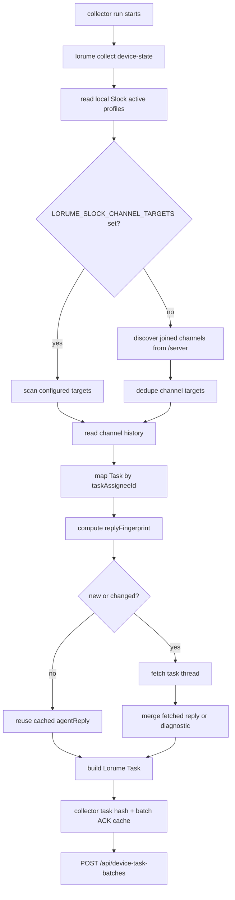

# Slock Agent Reply Incremental Enrichment Implementation Plan

> **For agentic workers:** REQUIRED SUB-SKILL: Use superpowers:subagent-driven-development (recommended) or superpowers:executing-plans to implement this plan task-by-task. Steps use checkbox (`- [ ]`) syntax for tracking.

**Goal:** Make Slock adapter default collection discover all current-device Tasks and enrich `agentReply` in the same collector run without re-reading every Task thread on every cycle.

**Architecture:** Slock Task discovery remains channel-history first: discover joined channels, read each channel once, map Task ownership by `taskAssigneeId`, and generate Lorume `Task` records. `agentReply` enrichment becomes cache-aware: compute a Slock reply fingerprint from stable thread-related fields, fetch thread history only for new or changed Tasks, reuse cached replies for unchanged Tasks, and keep core Task ingestion non-blocking if reply enrichment fails.

**Tech Stack:** Node.js 22 ESM scripts, Vitest CLI harness, existing Lorume collector Task batch / ACK cache, Slock agent-scoped read-only APIs.

---

## Context

Current observed facts from `gezilinll-claw` on 2026-05-23:

| Item | Result |
|---|---:|
| Active local Slock Agents | 8 |
| Auto-discovered joined channels | 16 |
| Slock history Task candidates | 249 |
| Current-device local active Tasks | 172 |
| `#AjisFarm` local active Tasks | 39 |
| PMO local active Tasks | 86 |

The earlier "1 Task" result was caused by scanning only explicitly configured targets such as `#zhangliang`. It was not representative of Slock data.

## Target Rules

| Concern | Rule |
|---|---|
| `LORUME_SLOCK_CHANNEL_TARGETS` | Optional scope override only. If set, scan only those targets. If unset, discover joined channels through Slock `/server`. |
| Default Task discovery | Always scan joined channels and emit every current-device Task that meets the product model. Do not cap or drop Task records for volume control. |
| Channel dedupe | In auto-discovery mode, scan each channel target once, then assign Tasks to local Agents by `taskAssigneeId`. |
| `agentReply` | Enrich in the same collector run when the Task is new or reply-relevant fields changed. Reuse local cache when unchanged. |
| Thread failures | Do not drop the core Task if thread reply enrichment fails. Emit a diagnostic and keep `agentReply` absent or cached. |
| Secrets | Slock auth token and device token must not enter cache, logs, fixtures, docs, or test output. |
| Persistence | Reply cache is local collector state, not a new product entity. No new first-class Conversation, Thread, SourceRef, Execution, or Run object. |

## Files

| File | Purpose |
|---|---|
| `scripts/lorume-runtime-adapters.mjs` | Implement Slock channel auto-discovery, reply fingerprint, reply cache, async read-only Slock requests, bounded thread enrichment, diagnostics. |
| `src/cli/lorume-cli.test.ts` | Add failing-first CLI tests for auto-discovery, cache reuse, changed reply fingerprints, and non-blocking thread failures. |
| `docs/product/runtime-slock-adapter-spec.md` | Update durable Slock adapter rules after behavior is implemented and verified. |
| `src/runtime/device-collector-script.test.ts` | Add collector-level assertion only if task hashes / batch upload behavior changes. Do not duplicate CLI adapter coverage. |

## Data Flow



## Cache Shape

The cache should be local and scoped. Default path:

```text
${LORUME_COLLECTOR_HOME:-$HOME}/.lorume/slock-reply-cache.json
```

Config override, only for tests or isolated runs:

```text
LORUME_SLOCK_REPLY_CACHE_PATH
config.slockReplyCachePath
config.slock.replyCachePath
```

Expected JSON shape:

```json
{
  "schemaVersion": "slock-reply-v1",
  "scope": {
    "baseUrl": "https://api.slock.ai",
    "deviceId": "gezilinll-claw"
  },
  "tasks": {
    "gezilinll-claw:runtime:codex:agent:slock:13679893-ce18-4e02-b941-1fb7c3b54674:task:f719e2b0-...": {
      "fingerprint": "hashStableJson(messageId/taskAssigneeId/taskStatus/replyCount/threadId/updatedAt/taskClaimedAt/taskCompletedAt)",
      "agentReply": "排查结论...",
      "replyUpdatedAt": "2026-05-23T06:20:00.000Z",
      "lastCheckedAt": "2026-05-23T12:00:00.000Z"
    }
  }
}
```

Do not store Slock auth token, device token, request headers, raw thread payload, or full profile payload in this cache.

## Reply Fingerprint

Use only stable source fields that can indicate reply/thread changes:

```js
function slockReplyFingerprint(message) {
  return hashStableJson({
    messageId: slockMessageId(message),
    taskAssigneeId: slockTaskAssigneeId(message),
    taskStatus: slockRawTaskStatus(message),
    replyCount: Number.isFinite(Number(message?.replyCount)) ? Number(message.replyCount) : null,
    threadId: message?.threadId || null,
    updatedAt: toIsoTimestamp(message?.updatedAt || message?.updated_at) || null,
    taskClaimedAt: toIsoTimestamp(message?.taskClaimedAt || message?.claimedAt) || null,
    taskCompletedAt: toIsoTimestamp(message?.taskCompletedAt || message?.completedAt) || null
  });
}
```

Decision rule:

| Case | Action |
|---|---|
| No cache entry and `replyCount === 0` | Do not fetch thread. Cache empty reply with current fingerprint. |
| No cache entry and `replyCount > 0` | Fetch thread in this run. |
| No cache entry and `replyCount` missing | Fetch thread once, because the source cannot prove there is no reply. |
| Cache entry exists and fingerprint matches | Reuse cached `agentReply` and `replyUpdatedAt`. |
| Cache entry exists and fingerprint differs | Fetch thread in this run and update cache. |
| Thread fetch fails | Keep core Task, reuse cached reply if available, emit diagnostic if no fresh reply could be confirmed. |

## Task 0: Close Current Channel Discovery Fix

**Files:**
- Modify: `scripts/lorume-runtime-adapters.mjs`
- Modify: `src/cli/lorume-cli.test.ts`
- Modify: `docs/product/runtime-slock-adapter-spec.md`

- [x] **Step 1: Run focused checks for current baseline**

Run:

```sh
npm run check:cli
npm run check:runtime
npm run check:repo
```

Expected:

```text
check:cli passes all CLI tests
check:runtime passes runtime tests
check:repo: ok
```

- [x] **Step 2: Run full verification before committing**

Run:

```sh
./scripts/verify.sh
```

Expected:

```text
verify: ok
```

- [x] **Step 3: Commit the channel discovery fix**

Run:

```sh
git add scripts/lorume-runtime-adapters.mjs src/cli/lorume-cli.test.ts docs/product/runtime-slock-adapter-spec.md
git commit -m "fix(runtime): auto-discover slock task channels"
```

Expected: one commit containing only the Slock channel discovery correctness fix and its spec/test updates.

## Task 1: Add Cache-Reuse Regression Test

**Files:**
- Modify: `src/cli/lorume-cli.test.ts`

- [x] **Step 1: Write failing test for same-run output and second-run cache reuse**

Add a test near the existing Slock CLI tests:

```ts
it("reuses cached Slock agent replies for unchanged discovered tasks", async () => {
  const server = await startSlockFixtureServer();
  const root = mkdtempSync(path.join(tmpdir(), "lorume-slock-reply-cache-"));
  const cachePath = path.join(root, "slock-reply-cache.json");
  try {
    const run = () => runCliAsync([
      "collect",
      "device-state",
      "--json",
      "--device-id",
      "fixture-device",
    ], {
      env: {
        LORUME_COLLECTOR_HOME: root,
        LORUME_ENABLED_RUNTIME_ADAPTERS: "slock",
        LORUME_SLOCK_SERVER_URL: server.baseUrl,
        LORUME_SLOCK_AUTH_TOKEN: "fixture-token",
        LORUME_SLOCK_AGENT_IDS: "agent-local-1",
        LORUME_SLOCK_COMPUTER_HOSTNAME: "fixture-device.local",
        LORUME_SLOCK_REPLY_CACHE_PATH: cachePath,
      },
    });

    const first = await run();
    const firstThreadReads = server.requests.filter((request) =>
      request.pathname === "/internal/agent/agent-local-1/history" &&
      request.channel === "#daily-work:msg-loca"
    );
    expect(first.tasks[0]).toMatchObject({
      agentReply: "今天的主要风险是接口稳定性和排期收敛。",
    });
    expect(firstThreadReads).toHaveLength(1);

    server.requests.length = 0;
    const second = await run();
    const secondThreadReads = server.requests.filter((request) =>
      request.pathname === "/internal/agent/agent-local-1/history" &&
      request.channel === "#daily-work:msg-loca"
    );
    expect(second.tasks[0]).toMatchObject({
      agentReply: "今天的主要风险是接口稳定性和排期收敛。",
    });
    expect(secondThreadReads).toHaveLength(0);
  } finally {
    await server.close();
  }
});
```

- [x] **Step 2: Verify the test fails**

Run:

```sh
npx vitest run src/cli/lorume-cli.test.ts -t "reuses cached Slock agent replies"
```

Expected: FAIL because no reply cache exists yet and default auto-discovery currently does not enrich `agentReply`.

## Task 2: Implement Reply Cache Helpers

**Files:**
- Modify: `scripts/lorume-runtime-adapters.mjs`

- [x] **Step 1: Add constants and cache path resolver**

Add near Slock constants:

```js
const SLOCK_REPLY_CACHE_SCHEMA_VERSION = "slock-reply-v1";

function resolveSlockReplyCachePath(config = {}) {
  return process.env.LORUME_SLOCK_REPLY_CACHE_PATH ||
    config.slockReplyCachePath ||
    config.slock?.replyCachePath ||
    path.join(homeDir(), ".lorume", "slock-reply-cache.json");
}
```

- [x] **Step 2: Add cache read/write helpers**

Add below Slock config helpers:

```js
function createSlockReplyCacheScope(baseUrl, deviceId) {
  return {
    baseUrl: normalizeSlockBaseUrl(baseUrl),
    deviceId: String(deviceId || ""),
  };
}

function normalizeSlockBaseUrl(baseUrl) {
  try {
    const url = new URL(String(baseUrl || ""));
    url.hash = "";
    url.search = "";
    url.pathname = url.pathname.replace(/\/+$/g, "");
    return url.toString().replace(/\/$/g, "");
  } catch {
    return String(baseUrl || "").replace(/\/+$/g, "");
  }
}

function readSlockReplyCache(cachePath, scope) {
  try {
    const parsed = JSON.parse(readFileSync(cachePath, "utf8"));
    if (
      parsed &&
      typeof parsed === "object" &&
      parsed.schemaVersion === SLOCK_REPLY_CACHE_SCHEMA_VERSION &&
      slockReplyCacheScopesEqual(parsed.scope, scope) &&
      parsed.tasks &&
      typeof parsed.tasks === "object"
    ) {
      return {
        schemaVersion: SLOCK_REPLY_CACHE_SCHEMA_VERSION,
        scope,
        tasks: parsed.tasks,
      };
    }
  } catch {
    // Missing or malformed cache starts empty.
  }
  return { schemaVersion: SLOCK_REPLY_CACHE_SCHEMA_VERSION, scope, tasks: {} };
}

function slockReplyCacheScopesEqual(left, right) {
  return Boolean(left && right) &&
    left.baseUrl === right.baseUrl &&
    left.deviceId === right.deviceId;
}

function writeSlockReplyCache(cachePath, cache) {
  mkdirSync(path.dirname(cachePath), { recursive: true });
  const tempPath = `${cachePath}.${process.pid}.tmp`;
  writeFileSync(tempPath, `${JSON.stringify(cache, null, 2)}\n`, "utf8");
  renameSync(tempPath, cachePath);
}
```

- [x] **Step 3: Update imports**

At the top of `scripts/lorume-runtime-adapters.mjs`, ensure the file imports write helpers:

```js
import { existsSync, mkdirSync, readdirSync, readFileSync, renameSync, statSync, writeFileSync } from "node:fs";
```

After implementation, run `npm run check:cli`. If Node reports an unused or duplicate import, remove the specific import named in the error output and rerun the same command.

## Task 3: Compute Reply Fingerprints

**Files:**
- Modify: `scripts/lorume-runtime-adapters.mjs`

- [x] **Step 1: Add fingerprint helper**

Add near Slock task helpers:

```js
function slockReplyFingerprint(message) {
  return hashStableJson({
    messageId: slockMessageId(message),
    taskAssigneeId: slockTaskAssigneeId(message),
    taskStatus: slockRawTaskStatus(message),
    replyCount: slockReplyCount(message),
    threadId: message?.threadId || null,
    updatedAt: toIsoTimestamp(message?.updatedAt || message?.updated_at) || null,
    taskClaimedAt: toIsoTimestamp(message?.taskClaimedAt || message?.claimedAt) || null,
    taskCompletedAt: toIsoTimestamp(message?.taskCompletedAt || message?.completedAt) || null,
  });
}

function slockReplyCount(message) {
  const value = Number(message?.replyCount ?? message?.reply_count);
  return Number.isFinite(value) && value >= 0 ? value : null;
}
```

- [x] **Step 2: Add cache decision helper**

Add below the fingerprint helper:

```js
function shouldFetchSlockAgentReply({ cachedEntry, fingerprint, message }) {
  if (cachedEntry?.fingerprint === fingerprint) return false;
  const replyCount = slockReplyCount(message);
  if (!cachedEntry && replyCount === 0) return false;
  return true;
}
```

## Task 4: Enrich Replies Without Blocking Core Tasks

**Files:**
- Modify: `scripts/lorume-runtime-adapters.mjs`

- [x] **Step 1: Load and save reply cache around Slock collection**

In `collectSlockDeviceState`, after base URL and auth validation:

```js
const replyCachePath = resolveSlockReplyCachePath(config);
const replyCacheScope = createSlockReplyCacheScope(baseUrl, device.id);
const replyCache = readSlockReplyCache(replyCachePath, replyCacheScope);
```

Pass `replyCache` into `collectSlockTasksFromChannel`.

Before returning from `collectSlockDeviceState`, write cache best-effort:

```js
try {
  writeSlockReplyCache(replyCachePath, replyCache);
} catch {
  diagnostics.add(slockDiagnostic("slock_reply_cache_write_failed", "warning", "adapter", "task_ingested_with_gap"), device.id);
}
```

- [x] **Step 2: Replace unconditional thread behavior with cache-aware behavior**

Inside `collectSlockTasksFromChannel`, after the `task` id can be derived:

```js
const taskId = makeProductTaskId(agent.id, messageId);
const fingerprint = slockReplyFingerprint(message);
const cachedReply = replyCache.tasks[taskId];
const shouldFetchReply = shouldFetchSlockAgentReply({ cachedEntry: cachedReply, fingerprint, message });
let agentReply = cachedReply?.fingerprint === fingerprint
  ? { text: cachedReply.agentReply || "", updatedAt: cachedReply.replyUpdatedAt }
  : { text: "", updatedAt: undefined };

if (shouldFetchReply) {
  const thread = readSlockHistoryPages({
    baseUrl,
    agentId: assigneeProfile.profileId,
    target: threadTarget,
    auth,
    diagnostics,
  });
  if (thread.incomplete) {
    diagnostics.add(slockDiagnostic("slock_agent_reply_fetch_failed", "warning", "task", "task_ingested_with_gap"), messageId);
  } else {
    agentReply = slockLatestAgentReply(thread.messages, assigneeProfile.profile, message);
  }
}

replyCache.tasks[taskId] = {
  fingerprint,
  agentReply: agentReply.text || "",
  replyUpdatedAt: agentReply.updatedAt,
  lastCheckedAt: new Date().toISOString(),
};
```

Remove the older `fetchThreadReplies` split after this behavior is in place. `LORUME_SLOCK_CHANNEL_TARGETS` should control only scan scope, not reply semantics.

- [x] **Step 3: Add diagnostics messages**

Add messages:

```js
slock_agent_reply_fetch_failed: `${count} 条 Slock Task 的 Agent 回复读取失败，已保留核心 Task。`,
slock_reply_cache_write_failed: `${count} 次 Slock Agent 回复缓存写入失败。`,
```

## Task 5: Add Changed-Fingerprint Regression Test

**Files:**
- Modify: `src/cli/lorume-cli.test.ts`

- [x] **Step 1: Extend fixture server with mutable thread state**

Inside `startSlockFixtureServer`, add local variables:

```ts
let dailyWorkReplyCount = 1;
let threadReplyText = "今天的主要风险是接口稳定性和排期收敛。";
```

Use them when returning `#daily-work` history:

```ts
const page = JSON.parse(readFixture(url.searchParams.has("before") ? "channel-history-page-2.json" : "channel-history-page-1.json"));
if (!url.searchParams.has("before")) page.messages[0].replyCount = dailyWorkReplyCount;
sendJson(200, JSON.stringify(page));
return;
```

Use `threadReplyText` in the `#daily-work:msg-loca` response:

```ts
if (url.pathname === "/internal/agent/agent-local-1/history" && url.searchParams.get("channel") === "#daily-work:msg-loca") {
  sendJson(200, JSON.stringify({
    messages: [{
      id: "reply-1",
      senderId: "agent-local-1",
      senderName: "大卷Bot",
      content: threadReplyText,
      createdAt: "2026-05-23T01:04:00.000Z",
      updatedAt: "2026-05-23T01:05:00.000Z",
    }],
  }));
  return;
}
```

Return test hooks from `startSlockFixtureServer`:

```ts
setDailyWorkReplyCount: (value: number) => {
  dailyWorkReplyCount = value;
},
setThreadReplyText: (value: string) => {
  threadReplyText = value;
},
```

- [x] **Step 2: Add failing test for changed `replyCount`**

Add test:

```ts
it("refreshes cached Slock agent replies when reply fingerprint changes", async () => {
  const server = await startSlockFixtureServer();
  const root = mkdtempSync(path.join(tmpdir(), "lorume-slock-reply-refresh-"));
  const cachePath = path.join(root, "slock-reply-cache.json");
  try {
    const env = {
      LORUME_COLLECTOR_HOME: root,
      LORUME_ENABLED_RUNTIME_ADAPTERS: "slock",
      LORUME_SLOCK_SERVER_URL: server.baseUrl,
      LORUME_SLOCK_AUTH_TOKEN: "fixture-token",
      LORUME_SLOCK_AGENT_IDS: "agent-local-1",
      LORUME_SLOCK_COMPUTER_HOSTNAME: "fixture-device.local",
      LORUME_SLOCK_REPLY_CACHE_PATH: cachePath,
    };
    await runCliAsync(["collect", "device-state", "--json", "--device-id", "fixture-device"], { env });
    server.setDailyWorkReplyCount(2);
    server.setThreadReplyText("风险已更新为接口回归和资源锁定。");
    const output = await runCliAsync(["collect", "device-state", "--json", "--device-id", "fixture-device"], { env });
    expect(output.tasks[0]).toMatchObject({
      agentReply: "风险已更新为接口回归和资源锁定。",
    });
  } finally {
    await server.close();
  }
});
```

- [x] **Step 3: Verify test fails before implementation and passes after implementation**

Run:

```sh
npx vitest run src/cli/lorume-cli.test.ts -t "refreshes cached Slock agent replies"
```

Expected after implementation: PASS.

## Task 6: Add Non-Blocking Thread Failure Regression Test

**Files:**
- Modify: `src/cli/lorume-cli.test.ts`

- [x] **Step 1: Add fixture hook to fail thread reads**

In `startSlockFixtureServer`, add:

```ts
let failThreadHistory = false;
```

In the thread route:

```ts
if (failThreadHistory) {
  sendJson(500, JSON.stringify({ error: "thread_unavailable" }));
  return;
}
```

Return hook:

```ts
failThreadHistory: () => {
  failThreadHistory = true;
},
```

- [x] **Step 2: Add failing test**

Add test:

```ts
it("keeps Slock Tasks when agent reply thread enrichment fails", async () => {
  const server = await startSlockFixtureServer();
  const root = mkdtempSync(path.join(tmpdir(), "lorume-slock-reply-failure-"));
  try {
    server.failThreadHistory();
    const output = await runCliAsync([
      "collect",
      "device-state",
      "--json",
      "--device-id",
      "fixture-device",
    ], {
      env: {
        LORUME_COLLECTOR_HOME: root,
        LORUME_ENABLED_RUNTIME_ADAPTERS: "slock",
        LORUME_SLOCK_SERVER_URL: server.baseUrl,
        LORUME_SLOCK_AUTH_TOKEN: "fixture-token",
        LORUME_SLOCK_AGENT_IDS: "agent-local-1",
        LORUME_SLOCK_CHANNEL_TARGETS: "#daily-work",
        LORUME_SLOCK_COMPUTER_HOSTNAME: "fixture-device.local",
      },
    });

    expect(output.tasks).toEqual([
      expect.objectContaining({
        id: "fixture-device:runtime:codex:agent:slock:agent-local-1:task:msg-local-1",
        userMessage: "帮我整理今天的项目风险",
      }),
    ]);
    expect(output.tasks[0]).not.toHaveProperty("agentReply");
    expect(output.diagnostics.items).toEqual(expect.arrayContaining([
      expect.objectContaining({ code: "slock_agent_reply_fetch_failed", severity: "warning" }),
    ]));
  } finally {
    await server.close();
  }
});
```

- [x] **Step 3: Run the focused test**

Run:

```sh
npx vitest run src/cli/lorume-cli.test.ts -t "keeps Slock Tasks when agent reply thread enrichment fails"
```

Expected after implementation: PASS.

## Task 7: Update Durable Spec

**Files:**
- Modify: `docs/product/runtime-slock-adapter-spec.md`

- [x] **Step 1: Update Agent Reply section**

Replace the current temporary default-mode wording with:

```md
`agentReply` is cache-aware enrichment. The adapter first discovers core Tasks from channel history, then uses a local reply cache to decide whether to fetch each Task thread in the same collector run. New or changed Tasks fetch thread history; unchanged Tasks reuse cached `agentReply`.
```

- [x] **Step 2: Update Diagnostics table**

Add:

```md
| `slock_agent_reply_fetch_failed` | `warning` | Task thread reply enrichment failed; adapter kept the core Task. |
| `slock_reply_cache_write_failed` | `warning` | Local reply cache write failed; adapter still returned Tasks. |
```

- [x] **Step 3: Keep boundaries explicit**

Ensure the spec includes exactly this rule:

```md
The reply cache is local collector state and not a Lorume product entity. It must not store secrets or raw thread payloads.
```

## Task 8: Verification

**Files:**
- No source edits unless a check fails.

- [x] **Step 1: Run focused CLI tests**

Run:

```sh
npm run check:cli
```

Expected:

```text
all src/cli tests pass with 0 failed tests
```

- [x] **Step 2: Run runtime and repo checks**

Run:

```sh
npm run check:runtime
npm run check:repo
```

Expected:

```text
check:runtime passes
check:repo: ok
```

- [x] **Step 3: Run full verification**

Run:

```sh
./scripts/verify.sh
```

Expected:

```text
verify: ok
```

## Task 9: Real Device Observer Validation

**Files:**
- No committed files. Temporary scripts may live under `/tmp` on `gezilinll-claw`.

- [x] **Step 1: Run default auto-discovery once with an empty Slock reply cache**

Run a read-only collector command on `gezilinll-claw` with:

```text
LORUME_ENABLED_RUNTIME_ADAPTERS=slock
LORUME_SLOCK_AGENT_IDS=<active local agent ids>
LORUME_SLOCK_REPLY_CACHE_PATH=/tmp/lorume-slock-reply-cache.json
```

Do not set `LORUME_SLOCK_CHANNEL_TARGETS`.

Expected:

```text
Task count is close to the read-only profiling baseline, currently 172.
agentReply is present for Tasks whose thread read succeeds.
No auth token appears in stdout, logs, or cache.
```

- [x] **Step 2: Run the same command again with the same cache**

Expected:

```text
Task count remains stable.
Thread request count drops sharply because unchanged Tasks reuse cached replies.
Output still includes cached agentReply values.
```

- [x] **Step 3: Inspect diagnostics**

Expected acceptable diagnostics:

```text
slock_remote_agent_task_ignored
slock_unassigned_task_ignored
slock_inactive_workspace_task_ignored
slock_agent_reply_fetch_failed only if specific thread reads failed
```

Unexpected diagnostics to investigate before upload:

```text
slock_channel_discovery_failed
slock_profile_unreadable
slock_history_pagination_incomplete on channel history
```

- [ ] **Step 4: Only after read-only validation, run local backend ingestion**

Use an isolated local backend/Postgres, not production. Validate:

```text
Task batches are posted through /api/device-task-batches.
Task hash changes only when user-visible Task fields or agentReply change.
Backend query returns Slock Tasks with adapter.kind="slock".
```

## Acceptance

| Check | Pass Condition |
|---|---|
| Default discovery | No `LORUME_SLOCK_CHANNEL_TARGETS` still discovers joined channels and emits current-device Tasks. |
| No missed PMO case | `#AjisFarm` PMO Tasks are included when present in source data. |
| Same-run reply enrichment | New or changed Tasks can include `agentReply` in the same collector run. |
| Cache reuse | Unchanged Tasks reuse cached `agentReply` without rereading thread history. |
| Non-blocking failures | Thread fetch failure does not drop core Task. |
| No secret leakage | Cache, logs, fixtures, docs, and stdout do not contain Slock auth tokens or device tokens. |
| Harness | `./scripts/verify.sh` passes. |

## Self-Review Notes

- No new product entities are introduced.
- `LORUME_SLOCK_CHANNEL_TARGETS` remains a scan-scope override, not a behavior switch.
- Slock-specific reply cache stays inside the Slock adapter and does not leak into React UI logic.
- The collector's existing Task batch ACK cache remains responsible for backend upload dedupe; the new Slock reply cache is only for avoiding repeated thread reads.
- Real-device validation remains observer-style: if files or data are wrong, fix project logic and rerun; do not manually patch remote output into passing shape.
