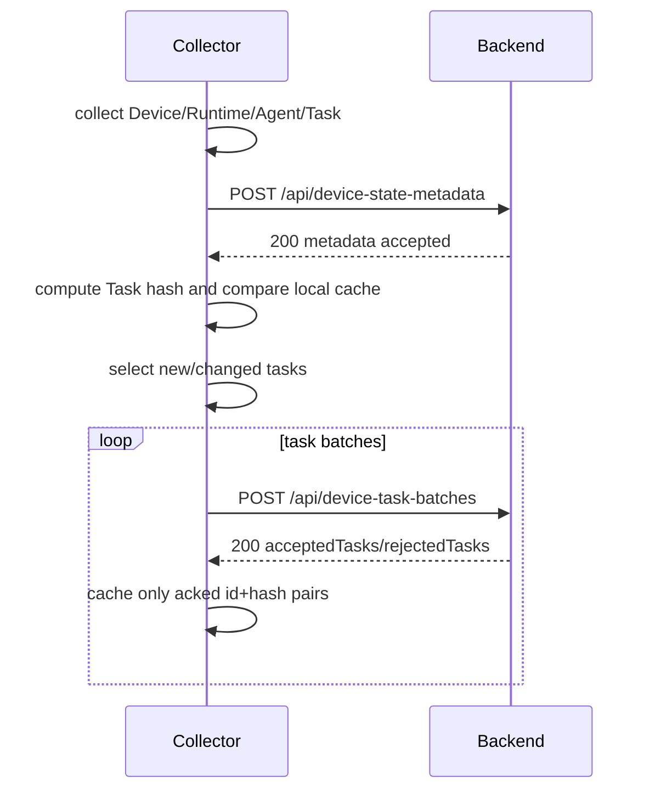

# Runtime Task Sync Implementation Plan

版本：Draft v0.1

本文记录下一轮 Runtime Task 模型和上报链路的落地方案。它是实施计划，不是长期并列 source of truth。落地完成后，确定规则必须并入 `docs/product/runtime-device-registration-spec.md`、`docs/product/runtime-openclaw-adapter-spec.md`、`src/runtime/runtime-model.ts` 和对应 harness；本文件应删除或改为历史决策记录，避免与正式 spec 冲突。

## 目标

- 将 Task 模型从 `title / description / toolCalls` 的大 payload 结构，收敛为 `userMessage / agentReply` 的极简结构。
- 将设备上报从单个大 `device_state` full snapshot，改为小体积 metadata full sync 加 Task 分批 upsert。
- Collector 本地用 `Task.id + Task.hash` 判断 new/changed Task，避免下一轮重复上传未变化任务。
- OpenClaw adapter 只上报用户视角真实 Task；内部 run、证据不足的会话任务进入 diagnostics。
- 保持 Device / Runtime / Agent / Task 四对象模型，不引入 Conversation、Execution、ToolCall、Run 等一等实体。

## 非目标

- 第一版不做删除同步、tombstone 或服务端按本轮缺失 Task 清理。
- 第一版不重新引入 `toolCalls`、`description`、`title` 或 `Task.lastSeenAt`。
- 第一版不支持后端通过 WebSocket 下发采集、探测、任务调度或任意命令。
- 第一版不默认启用 Slock、Multica、Codex 或 Claude Code adapter。
- 第一版不把 raw、diagnostics、内部 path、adapter 命令或外部 opaque id 暴露为 UI 主模型字段。

## 核心原则

| 原则 | 规则 |
|---|---|
| 确定性 | 数据结构、hash、同步协议必须有机械确定规则；不要写“如果稳定就...”这类落地时再判断的规则。 |
| 极简字段 | 同一份语义不要同时存多份。`title` 由 `userMessage` 派生，`description` 删除。 |
| 采集与业务分离 | `Task.status` 表达任务状态；缺字段、解析失败、过滤内部 run 属于 adapter diagnostics。 |
| 同步与业务分离 | `batchId`、ack、本地缓存、hash 是同步协议数据，不进入 Task 产品字段。 |
| 观察者验证 | 真实设备验收发现残留或异常时，修项目能力和测试，再重跑能力；不手工修设备结果。 |
| 无历史包袱 | 旧字段、旧 API、旧测试不保兼容；落地后文档、代码、数据库、测试都指向最新规则。 |
| 测试隔离 | 自动化测试不得写真实后端或生产数据库；真实设备验证只做观察和产品能力验收。 |

## 目标数据结构

### Task

```ts
export type TaskStatus =
  | "todo"
  | "in_progress"
  | "review"
  | "done"
  | "blocked"
  | "failed"
  | "cancelled"
  | "unknown";

export interface Task {
  id: string;
  agentId: string;
  taskType: "conversation" | "scheduled";
  status: TaskStatus;

  userMessage?: string;
  agentReply?: string;

  creator?: {
    name?: string;
    externalId?: string;
  };

  assignee?: {
    name: string;
    externalId?: string;
  };

  channel?: {
    kind: "dingtalk" | "webchat" | "telegram" | "slack" | "other";
    name?: string;
    externalId?: string;
  };

  conversation?: {
    title?: string;
    externalId?: string;
    lastActivityAt?: string;
  };

  source?: {
    kind: "openclaw";
    externalId?: string;
  };

  raw?: {
    openclaw?: {
      status?: string;
      statusSource?: "session" | "trajectory" | "tasks_list";
      sessionId?: string;
      sessionKey?: string;
      messageId?: string;
      trajectoryRunId?: string;
    };
  };

  error?: string;
  createdAt?: string;
  updatedAt?: string;
}
```

删除字段：

| 字段 | 处理 | 原因 |
|---|---|---|
| `title` | 删除 | 从 `userMessage` 派生 `displayTitle`，不重复存储。 |
| `description` | 删除 | 当前常装入 OpenClaw assembled context，体积大且语义不清。 |
| `toolCalls` | 删除 | 跨平台不稳定，且当前真实样本中是 payload 最大来源。 |
| `lastSeenAt` | 从 Task 删除 | 它是采集新鲜度，不是 Task 源业务时间。 |
| `runtimeId` | 不新增 | Task 只关联 Agent；Runtime/Device 通过 join 得到。 |
| `lastRun` / `execution` | 不新增 | 当前 Task 自身就是最新执行实例视角。 |

### 时间字段

| 字段 | 对象 | 规则 |
|---|---|---|
| `collectedAt` | Metadata envelope | Collector 在设备端完成本轮采集的时间；替代当前 `observedAt`。 |
| `receivedAt` | 后端 ingestion | 后端收到上报的时间，由服务端生成。 |
| `lastSeenAt` | Device / Runtime / Agent | Collector 最近一次看到该对象的时间；不用于 Task。 |
| `createdAt` | Task | 源系统中任务创建时间：会话消息时间或 cron run start。拿不到就不填。 |
| `updatedAt` | Task | 源系统中任务最后业务事件时间：trajectory/session 的最后事件或结束时间。拿不到就不填。 |

Adapter 不能用 collector 当前时间兜底写入 `Task.createdAt` 或 `Task.updatedAt`。如果源系统没有对应事件时间，字段省略。

### Metadata Sync Payload

```ts
export interface DeviceStateMetadata {
  schemaVersion: "device-state-v2";
  collectedAt: string;
  device: Device;
  runtimes: Runtime[];
  agents: Agent[];
  diagnostics?: {
    warnings?: RuntimeDiagnostic[];
  };
}
```

### Task Batch Payload

```ts
export interface TaskBatch {
  schemaVersion: "device-state-v2";
  deviceId: string;
  collectedAt: string;
  batchId: string;
  batchIndex: number;
  tasks: Array<{
    task: Task;
    hash: string;
  }>;
}

export interface TaskBatchAck {
  accepted: true;
  acceptedTasks: Array<{
    id: string;
    hash: string;
  }>;
  rejectedTasks?: Array<{
    id: string;
    hash: string;
    error: string;
  }>;
}
```

`acceptedTasks` 必须同时返回 `id` 和 `hash`，collector 只能在 ack hash 与本地当前 hash 一致时更新本地缓存，避免旧 ack 覆盖新采集结果。

### Collector Local Sync State

```ts
export interface CollectorTaskSyncState {
  schemaVersion: "device-state-v2";
  collectorVersion: string;
  deviceId: string;
  tasks: Record<string, {
    hash: string;
    lastAckedAt: string;
  }>;
}
```

本地缓存只记录已被后端确认的 `id + hash`。上传失败、请求超时、后端拒绝或 hash 不匹配时，collector 不更新本地缓存；下一轮自然重传。

## Task Hash 规则

### Hash 输入

```ts
const taskHashInput = {
  hashVersion: 1,
  id: task.id,
  agentId: task.agentId,
  taskType: task.taskType,
  status: task.status,
  userMessage: normalizeText(task.userMessage),
  agentReply: normalizeText(task.agentReply),
  creator: normalizeObject(task.creator),
  assignee: normalizeObject(task.assignee),
  channel: normalizeObject(task.channel),
  conversation: normalizeObject(task.conversation),
  source: normalizeObject(task.source),
  error: normalizeText(task.error),
  createdAt: task.createdAt ?? null,
  updatedAt: task.updatedAt ?? null,
};
```

### 不参与 hash

| 字段 | 原因 |
|---|---|
| `collectedAt` / `observedAt` | 每轮采集都会变化，会导致无意义重传。 |
| `lastSeenAt` | 采集新鲜度，不是 Task 业务语义。 |
| `raw` | 排障溯源证据，可能含 adapter 噪声。 |
| `diagnostics` / `warnings` | 采集质量信息，不是 Task 内容。 |
| `batchId` / `batchIndex` | 同步协议字段。 |
| `displayTitle` | UI/BFF 派生字段。 |

### 规范化

```ts
function normalizeText(value?: string): string | null {
  const text = value?.replace(/\r\n/g, "\n").trim();
  return text ? text : null;
}
```

Object hash 必须使用稳定 key 排序。`undefined` 字段按缺失处理，空字符串和纯空白文本按 `null` 处理。

## OpenClaw Adapter 规则

### Task 类型和入库规则

| OpenClaw 证据 | 处理 |
|---|---|
| DingTalk/WebChat 用户会话 turn | 生成 `taskType="conversation"` Task。 |
| Cron run | 生成 `taskType="scheduled"` Task。 |
| `announce:v1`、subagent、system、background、manual、无法归类 run | 不生成 Task，写 diagnostics。 |
| 会话任务缺 `userMessage` | 不作为正常 Task 上报，写 diagnostics。 |
| `done` 任务缺 `agentReply` | 可上报，`agentReply` 为空，同时写 diagnostics。 |

### 字段映射

| Task 字段 | OpenClaw 来源 | 规则 |
|---|---|---|
| `id` | message id 或 trajectory run id | `${agentId}:task:${externalTaskId}`。 |
| `agentId` | `sessionKey` 中的 agent id | 必须映射到本轮采集到的 Agent。 |
| `taskType` | `sessionKey`、cron prompt、用户触点证据 | 只允许 `conversation` 或 `scheduled`。 |
| `status` | trajectory/session/tool 原始状态 | adapter 映射成 Lorume `TaskStatus`。 |
| `userMessage` | 会话任务：DingTalk inbound message context；定时任务：cron prompt | 会话任务不得用 assembled context 兜底。 |
| `agentReply` | trajectory `assistantTexts` | 可为空，后续补上时 hash 变化并重传。 |
| `creator` | inbound message sender | 会话任务尽量填；定时任务可为空。 |
| `assignee` | OpenClaw agent | 找不到更具体 assignee 时固定 `{ name: "main", externalId: "main" }`。 |
| `channel` / `conversation` | DingTalk/WebChat context | 只存用户触点渠道，不把 OpenClaw 当 channel。 |
| `source` | adapter 固定 + external id | `kind="openclaw"`。 |
| `raw.openclaw` | session/trajectory/message 溯源 id | 仅用于排障，不参与 hash。 |
| `createdAt` | 用户消息时间或 cron run start | 无源时间就省略。 |
| `updatedAt` | trajectory/session 最后业务事件时间 | 无源时间就省略。 |

### Diagnostics

第一版 diagnostics 使用结构化项：

```ts
export interface RuntimeDiagnostic {
  code:
    | "openclaw_internal_run_filtered"
    | "openclaw_conversation_missing_user_message"
    | "openclaw_done_task_missing_agent_reply"
    | "openclaw_trajectory_parse_failed"
    | "openclaw_task_window_truncated"
    | "openclaw_adapter_unavailable";
  severity: "info" | "warning" | "error";
  count?: number;
  samples?: Array<Record<string, string>>;
}
```

Diagnostics 只允许包含少量截断样本 id，例如 `trajectoryRunId`、`sessionKey`、`messageId`。Diagnostics 不得包含 device token、平台 token、完整私有 prompt、手机号、完整 opaque conversation id 或其他敏感信息。

## 同步协议

### 流程



### Endpoint 目标

| Endpoint | 作用 |
|---|---|
| `POST /api/device-state-metadata` | Upsert Device、Runtime、Agent 和 diagnostics。 |
| `POST /api/device-task-batches` | 幂等 upsert new/changed Task。 |
| `GET /api/runtime-fleet` | 返回 Runtime Fleet 视图，Task 只用于计数聚合。 |
| `GET /api/runtime-tasks` | 分页查询 Task，返回派生 `displayTitle` 和消息字段。 |

所有 collector POST 请求都应支持 `Content-Encoding: gzip`。后端必须先按压缩后和解压后大小分别做限制，再解析 JSON。

### Task 上传选择

| 本地缓存状态 | 当前 hash | 动作 |
|---|---|---|
| 无 `task.id` | 任意 | 上传。 |
| 有 `task.id` 且 hash 相同 | 相同 | 跳过。 |
| 有 `task.id` 但 hash 不同 | 不同 | 上传。 |
| 上轮上传失败或未 ack | 本地无 acked hash | 上传。 |

### 分批规则

- 默认按 JSON 字节预算切批，而不是只按数量切批。
- 第一版使用 `batchMaxBytes = 512 KiB`、`batchMaxTasks = 1000`，实际以先达到的限制为准。
- 批内 Task 顺序固定：`updatedAt desc -> createdAt desc -> id asc`，缺时间的排在最后。
- `batchId` 由 `deviceId + collectedAt + batchIndex + task id/hash 列表` 计算，保证同一批重试幂等。
- 后端以 `Task.id` upsert；同一 `Task.id + hash` 重复提交必须成功且不产生重复记录。

### 删除策略

第一版不做删除。原因是 OpenClaw 本地历史窗口变化不等于任务被删除，旧任务可能只是超出 adapter 扫描窗口。

| 场景 | 第一版处理 |
|---|---|
| 新 Task | upsert。 |
| Task 内容变化 | upsert。 |
| Task 本轮未出现 | 不删除。 |
| 存储过大 | 后端按保留策略治理。 |

后续确有删除需求时，再引入 tombstone；不得在第一版通过“本轮缺失”隐式删除。

## UI / API 适配

- `displayTitle` 由查询层或 UI 从 `userMessage` 派生，不入库。
- Runs 卡片主标题使用 `displayTitle`。
- 消息摘要使用 `userMessage`。
- 详情页展示 `userMessage` 和可选 `agentReply`。
- 搜索字段应覆盖 `userMessage`、`agentReply`、`status`、`channel.name`、`conversation.title`、`creator.name`、`assignee.name`、`agentId` 和 Runtime/Agent join 名称。
- 前端不得从 `raw`、diagnostics、opaque external id 或平台私有路径推断展示文案。

## 数据库落地方向

目标迁移应移除或停止使用 `tasks.title`、`tasks.description` 和 Task `last_seen_at`，增加：

| 列 | 用途 |
|---|---|
| `user_message` | 查询、搜索、UI 摘要。 |
| `agent_reply` | 查询和详情展示。 |
| `task_hash` | 保存最近一次已接受 Task hash，用于幂等和诊断。 |
| `created_source_at` | Task 源创建时间。 |
| `updated_source_at` | Task 源更新时间。 |

`tasks.raw` 可继续保存规范化后的 Task JSON，但 public API 不应要求前端读取 raw。

## 测试金字塔

| 层级 | 覆盖点 |
|---|---|
| Unit | Task normalization 删除旧字段、新字段校验、`collectedAt`、hash 稳定性、文本规范化、批次切分。 |
| Adapter unit/fixture | OpenClaw 内部 run 过滤、缺 `userMessage` diagnostics、定时任务映射到 `userMessage`、`agentReply` 可选、assignee 默认 `main`。 |
| Collector script | 本地缓存 `id + hash`、只上传 new/changed、失败不写缓存、ack hash 匹配才写缓存、gzip POST。 |
| Backend API | metadata upsert、task batch upsert、幂等重传、partial rejected tasks、gzip 解压和大小限制、鉴权。 |
| DB integration | 迁移、upsert、搜索、分页、Runtime/Agent join、无旧字段依赖。 |
| Browser E2E | Runs / Work Board 用 `displayTitle`、`userMessage`、`agentReply` 展示和搜索。 |
| Backend E2E | isolated local backend/Postgres，真实 collector process 或接近真实脚本分批上报。 |
| Real device observation | 自动化通过后，在 `gezilinll-claw` 观察卸载/安装/采集/分批/重传，不手工修数据。 |

测试禁止连接或修改真实生产后端、生产数据库或已部署域名状态。域名可达性、ICP/TLS、线上 installer 可达性属于运维验证，不作为项目 harness 条件。

## 落地阶段

### Phase 1: Spec and Harness Guard

- 更新正式 specs：`runtime-device-registration-spec.md`、`runtime-openclaw-adapter-spec.md`、`runtime-task-acceptance-spec.md`。
- 更新 `src/runtime/runtime-model.ts` 的目标类型和 normalization 测试。
- 新增 Task hash 和 batch split 的纯逻辑测试。
- 运行 `npm run check:repo`、`npm run check:runtime`。

### Phase 2: OpenClaw Adapter Slim Task

- 修改 OpenClaw adapter 输出新 Task。
- 移除 `title`、`description`、`toolCalls`、Task `lastSeenAt`。
- 实现 `userMessage`、`agentReply`、assignee 默认 `main`、内部 run 过滤、缺字段 diagnostics。
- 用真实 profiling 样本和 fixture 验证字段覆盖率。

### Phase 3: Backend Schema and API

- 新增 metadata endpoint 和 task batch endpoint。
- 新增/调整 Postgres migration。
- 修改 Runtime Fleet 和 Runtime Tasks 查询，提供派生 `displayTitle`。
- 不保留旧 API 兼容；测试应验证新协议，不测试已删除逻辑。

### Phase 4: Collector Sync

- Collector 生成 `DeviceStateMetadata`。
- Collector 计算 Task hash、本地缓存 acked hash、按字节切批。
- Collector 支持 gzip POST、失败重试、partial ack。
- 本地缓存文件不得写 token、raw prompt 或完整平台敏感数据。

### Phase 5: UI and E2E

- Runs / Work Board 改用 `displayTitle`、`userMessage`、`agentReply`。
- 搜索和筛选迁移到新字段。
- Backend E2E 覆盖分批上报链路。
- Browser E2E 覆盖新 Task 展示。

### Phase 6: Real Device Observation

- 在自动化测试通过后，对 `gezilinll-claw` 做真实设备观察者验证。
- 验证卸载/安装、metadata 上报、Task 分批、失败重传、本地缓存、后端查询。
- 如果发现测试金字塔漏掉的问题，先补对应层级测试，再修实现，再重跑。

## 验收标准

- `lorume collect device-state` 不再输出旧 Task 字段。
- 单轮 metadata payload 不包含 Task 大数组。
- Task batch 只上传 new/changed Task。
- `agentReply` 从空变有值、`status` 从 `in_progress` 变 `done`、`userMessage` 被补齐时，hash 变化并重新上传。
- 会话 Task 缺 `userMessage` 不进入正常 Task 查询，diagnostics 可见。
- 内部 OpenClaw run 不进入正常 Task 查询。
- Runs / Work Board 不依赖 `title` 或 `description`。
- 自动化测试在本地隔离后端/Postgres 通过。
- 真实设备验证不需要手工清理或手工改数据即可通过产品能力完成。
